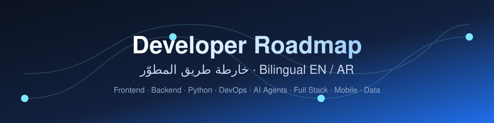
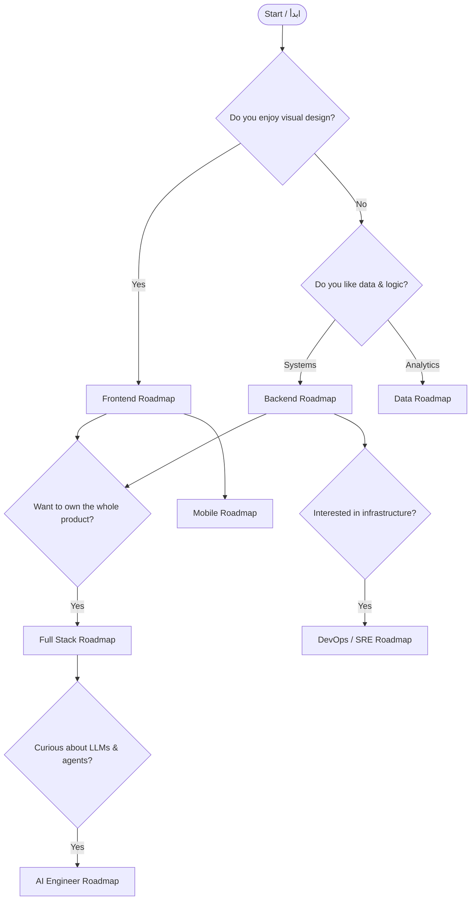

<div align="center">



# 🧭 Developer Roadmap · خارطة طريق المطوّر

**Interactive, bilingual (English / العربية) learning roadmaps for developers — from first line of code to senior engineer.**

**خرائط طريق تفاعلية ثنائية اللغة للمطوّرين — من أول سطر كود إلى مهندس خبير.**

**Created & maintained by [Majid Al-Sakani · ماجد السكني](https://github.com/majid-alsakani)** — Full Stack &amp; AI Engineer · Python · FastAPI · Django · React · AI Agents · Yemen 🇾🇪

**إعداد وصيانة [ماجد السكني · Majid Al-Sakani](https://github.com/majid-alsakani)** — مهندس برمجيات متكامل وذكاء اصطناعي — اليمن

[](https://majid-alsakani.github.io/developer-roadmap/)
[](#-all-roadmaps--كل-الخرائط)
[](#)
[](LICENSE)
[](https://github.com/majid-alsakani/developer-roadmap/stargazers)

</div>

---

## 🎯 Why this repository / لماذا هذا المستودع

| | English | العربية |
|---|---|---|
| 🌍 | **Truly bilingual.** Every roadmap is written for both Arabic and international readers — no machine translation. | **ثنائي اللغة فعليًا.** كل خريطة مكتوبة للقارئ العربي والعالمي — بدون ترجمة آلية. |
| 🗺️ | **Real diagrams.** Each path renders as a live Mermaid graph, not a static screenshot. | **مخططات حقيقية.** كل مسار يُعرض كمخطط Mermaid حيّ وليس صورة ثابتة. |
| ✅ | **Trackable.** Fork it and tick the checkboxes — the repo becomes your progress log. | **قابل للتتبّع.** اعمل Fork وعلّم المربعات — يصبح سجل تقدّمك. |
| 🧪 | **Opinionated & current.** Modern stacks only (2026): TypeScript, React 19, FastAPI, Kubernetes, LLM agents. | **محدّث وحاسم.** تقنيات ٢٠٢٦ فقط: TypeScript وReact 19 وFastAPI وKubernetes ووكلاء الذكاء الاصطناعي. |
| 🆓 | **Free forever.** No paywall, no signup, no ads. | **مجاني للأبد.** بلا اشتراك ولا تسجيل ولا إعلانات. |

---

## 🧭 All roadmaps / كل الخرائط

> ### 🏆 <a href="roadmaps/professional.md">Professional Software Engineer — مسار المبرمج المحترف</a> <sup>NEW</sup>
> The senior track by **Majid Al-Sakani**: engineering mindset, clean architecture, testing, security, DevOps, AI-augmented workflow and career growth — **8 stages · 45 topics**.
> 
> المسار الاحترافي بإعداد **ماجد السكني**: عقلية الهندسة، البنية النظيفة، الاختبار، الأمان، DevOps، العمل مع الذكاء الاصطناعي، والنمو المهني — **٨ مراحل · ٤٥ موضوعًا**.
> 
> [](roadmaps/professional.md) [](https://majid-alsakani.github.io/developer-roadmap/roadmap.html?r=professional)

<table>
<tr>
<td width="50%" valign="top">

### 🎨 <a href="roadmaps/frontend.md">Frontend Developer</a>
**مطور الواجهات الأمامية**

From HTML fundamentals to production-grade React architecture.  
من أساسيات HTML إلى معمارية React جاهزة للإنتاج.

[](roadmaps/frontend.md)

</td>
<td width="50%" valign="top">

### 🛠️ <a href="roadmaps/backend.md">Backend Developer</a>
**مطور الواجهات الخلفية**

APIs, databases, queues and distributed systems done properly.  
واجهات برمجية وقواعد بيانات وطوابير وأنظمة موزعة بشكل صحيح.

[](roadmaps/backend.md)

</td>
</tr>
<tr>
<td width="50%" valign="top">

### 🐍 <a href="roadmaps/python.md">Python Engineer</a>
**مهندس بايثون**

Modern Python: typing, async, packaging and performance.  
بايثون الحديثة: الأنواع، التزامن، التغليف والأداء.

[](roadmaps/python.md)

</td>
<td width="50%" valign="top">

### ⚙️ <a href="roadmaps/devops.md">DevOps / SRE</a>
**هندسة العمليات والموثوقية**

Ship safely, observe everything, automate the boring parts.  
نشر آمن، مراقبة شاملة، وأتمتة كل ما هو ممل.

[](roadmaps/devops.md)

</td>
</tr>
<tr>
<td width="50%" valign="top">

### 🤖 <a href="roadmaps/ai-engineer.md">AI / Agents Engineer</a>
**مهندس الذكاء الاصطناعي والوكلاء**

From prompts to production agents with tools, memory and evals.  
من التلقين إلى وكلاء إنتاجيين بأدوات وذاكرة وتقييم.

[](roadmaps/ai-engineer.md)

</td>
<td width="50%" valign="top">

### 🚀 <a href="roadmaps/fullstack.md">Full Stack Developer</a>
**مطور متكامل**

One person, one product: frontend, backend, data and delivery.  
شخص واحد، منتج كامل: واجهة وخلفية وبيانات ونشر.

[](roadmaps/fullstack.md)

</td>
</tr>
<tr>
<td width="50%" valign="top">

### 📱 <a href="roadmaps/mobile.md">Mobile Developer</a>
**مطور تطبيقات الجوال**

Cross-platform apps that feel native on both stores.  
تطبيقات متعددة المنصات بإحساس أصلي على المتجرين.

[](roadmaps/mobile.md)

</td>
<td width="50%" valign="top">

### 📊 <a href="roadmaps/data.md">Data Engineer</a>
**مهندس البيانات**

Reliable pipelines, modeled warehouses, trusted metrics.  
خطوط بيانات موثوقة ومستودعات منمذجة ومؤشرات جديرة بالثقة.

[](roadmaps/data.md)

</td>
</tr>
</table>

---

## 🚦 Which path should I take? / أي مسار أختار؟



---

## 📚 How to use / طريقة الاستخدام

**English**
1. Pick a roadmap from the table above (or open the [live site](https://majid-alsakani.github.io/developer-roadmap/)).
2. Fork this repository so the checkboxes become yours.
3. Work top-down: never skip a stage, but skim what you already know.
4. Ship one project per stage and link it in your fork's README.
5. Re-audit yourself every quarter.

**العربية**
1. اختر خريطة من الجدول أعلاه (أو افتح [الموقع المباشر](https://majid-alsakani.github.io/developer-roadmap/)).
2. اعمل Fork للمستودع حتى تصبح المربعات ملكك.
3. اتبع الترتيب من الأعلى للأسفل، ولا تتخطى مرحلة كاملة.
4. أنجز مشروعًا واحدًا في كل مرحلة واربطه في README نسختك.
5. أعد تقييم نفسك كل ثلاثة أشهر.

---

## 🤝 Contributing / المساهمة

Contributions are very welcome — a new roadmap, a corrected link, a better Arabic phrasing.  
المساهمات مرحّب بها: خريطة جديدة، رابط مصحّح، أو صياغة عربية أفضل.

Read **[CONTRIBUTING.md](CONTRIBUTING.md)** first. Every roadmap follows the same template so the repo stays consistent.

---

## 🗂️ Repository structure / بنية المستودع

```text
developer-roadmap/
├── README.md                 # you are here
├── roadmaps/                 # one Markdown file per learning path
│   ├── index.json            # machine-readable catalog (used by the site)
│   ├── frontend.md
│   ├── backend.md
│   └── ...
├── docs/                     # GitHub Pages site (search + dark mode + RTL)
│   ├── index.html
│   ├── robots.txt
│   └── sitemap.xml
├── assets/                   # banner and shared images
├── .github/workflows/        # Pages deploy + link checking
├── CONTRIBUTING.md
├── CODE_OF_CONDUCT.md
└── LICENSE                   # CC BY-SA 4.0
```

---

<div align="center">

### ⭐ If this helped you, star the repo — it is how other developers find it.
### ⭐ إذا أفادك المستودع، ضع نجمة — بها يجده مطورون آخرون.

Built and maintained by **[Majid Al-Sakani · ماجد السكني](https://github.com/majid-alsakani)** — Full Stack Developer (Python · FastAPI · Django · React), Yemen 🇾🇪

<sub>Keywords: developer roadmap, خارطة طريق المبرمج, frontend roadmap, backend roadmap, python roadmap, devops roadmap, AI engineer roadmap, تعلم البرمجة, مسار تعلم البرمجة بالعربي, learn programming 2026, software engineer career path</sub>

</div>

---

## 🧭 Interactive Roadmap Engine · محرّك الخرائط التفاعلي

> Inspired by the UX of roadmap.sh — rebuilt from scratch, bilingual (AR/EN), zero dependencies, no tracking.
> مستوحى من تجربة roadmap.sh — مبني من الصفر، ثنائي اللغة، بدون أي مكتبات خارجية أو تتبّع.

**▶ افتح الخرائط التفاعلية / Open the interactive maps:** <https://majid-alsakani.github.io/developer-roadmap/>

| Feature | English | العربية |
|---|---|---|
| 🗺️ | **Node-based visual maps** with a central spine, stage titles and branching topics | خرائط بصرية على شكل عُقد بعمود مركزي ومراحل وفروع |
| ✅ | **Progress tracking** — mark each topic as Done / Learning / Skip, saved in your browser | تتبّع التقدّم — أنجزته / أتعلّمه / تخطّيته، محفوظ في متصفحك |
| 📊 | **Live completion bar** per roadmap | شريط إنجاز حيّ لكل خريطة |
| 🎯 | **Topic types**: Core · Recommended · Optional (colour-coded) | تصنيف المواضيع: أساسي · موصى به · اختياري |
| 📚 | **Detail drawer** with curated free resources per topic | لوحة تفاصيل بمصادر مجانية منتقاة لكل موضوع |
| 🌗 | Dark / light theme + instant **AR ⇄ EN** switch with full RTL | وضع ليلي/نهاري وتبديل فوري بين العربية والإنجليزية مع دعم RTL |
| 🔎 | Searchable hub + JSON-LD `ItemList` structured data for SEO | صفحة فهرس قابلة للبحث وبيانات منظّمة لمحركات البحث |
| 🧩 | Data-driven: every roadmap is a JSON file in `docs/data/` — easy to extend via PR | كل خريطة ملف JSON قابل للتوسعة بسهولة عبر Pull Request |

### 🗂️ Interactive maps · الخرائط التفاعلية

| # | Roadmap | الخريطة | Topics |
|---|---|---|---|
| 1 | [Frontend Developer](https://majid-alsakani.github.io/developer-roadmap/roadmap.html?r=frontend) | مطوّر الواجهات الأمامية | 31 |
| 2 | [Backend Developer](https://majid-alsakani.github.io/developer-roadmap/roadmap.html?r=backend) | مطوّر الواجهات الخلفية | 30 |
| 3 | [AI / Agents Engineer](https://majid-alsakani.github.io/developer-roadmap/roadmap.html?r=ai-engineer) | مهندس الذكاء الاصطناعي والوكلاء | 26 |
| 4 | [Python Developer](https://majid-alsakani.github.io/developer-roadmap/roadmap.html?r=python) | مطوّر بايثون | 19 |
| 5 | [DevOps Engineer](https://majid-alsakani.github.io/developer-roadmap/roadmap.html?r=devops) | مهندس DevOps | 21 |
| 6 | [Full Stack Developer](https://majid-alsakani.github.io/developer-roadmap/roadmap.html?r=fullstack) | مطوّر متكامل | 17 |
| 7 | [Mobile Developer](https://majid-alsakani.github.io/developer-roadmap/roadmap.html?r=mobile) | مطوّر تطبيقات الجوال | 15 |
| 8 | [Data Engineer](https://majid-alsakani.github.io/developer-roadmap/roadmap.html?r=data) | مهندس البيانات | 21 |

**Total: 8 roadmaps · 30 stages · 180 topics · 100% bilingual**

```
docs/
├── index.html          # searchable hub / فهرس قابل للبحث
├── roadmap.html        # interactive renderer / العارض التفاعلي
├── assets/             # roadmap.css · roadmap.js · hub.js
└── data/*.json         # roadmap definitions / تعريفات الخرائط
```
