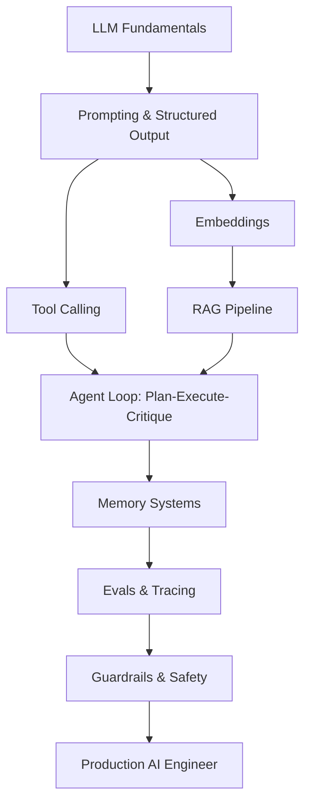

# 🤖 AI / Agents Engineer Roadmap
### مهندس الذكاء الاصطناعي والوكلاء

*From prompts to production agents with tools, memory and evals.*  
**من التلقين إلى وكلاء إنتاجيين بأدوات وذاكرة وتقييم.**

---

## 🗺️ The Map / الخريطة

---

## ✅ Step-by-step checklist / قائمة التقدم

### 1. Fundamentals / الأساسيات

- [ ] LLM basics: tokens, context window, sampling
- [ ] Prompt engineering & structured output
- [ ] Embeddings & vector similarity
- [ ] Cost/latency tradeoffs per model

### 2. RAG / الاسترجاع

- [ ] Chunking & metadata strategy
- [ ] Vector stores: pgvector, Qdrant
- [ ] Hybrid search & reranking
- [ ] Grounding, citations, hallucination control

### 3. Agents / الوكلاء

- [ ] Tool calling & typed tool registries
- [ ] Planner → Executor → Critic loops
- [ ] Short/long term memory design
- [ ] Multi-agent orchestration & handoffs
- [ ] Guardrails, sandboxing, permissioning

### 4. Production / الإنتاج

- [ ] Evals: golden sets, LLM-as-judge, regression suites
- [ ] Tracing & span-level observability
- [ ] Streaming (SSE) UX patterns
- [ ] Caching, batching, fallback models
- [ ] Safety, PII redaction, audit logs

---

## 📌 How to use this roadmap / كيف تستخدم الخريطة

1. Fork this repository — your fork becomes your personal progress tracker.
2. Tick the checkboxes as you master each item (`- [x]`).
3. Build one real project per stage; theory without shipping does not count.
4. Revisit every 3 months — the map evolves, so should you.

1. اعمل Fork للمستودع — النسخة تصبح سجل تقدّمك الشخصي.
2. علّم المربعات كلما أتقنت بندًا.
3. ابنِ مشروعًا حقيقيًا في كل مرحلة؛ النظرية بلا تنفيذ لا تُحتسب.
4. راجع الخريطة كل ٣ أشهر.

> Maintained by [Majid Al-Sakani](https://github.com/majid-alsakani) · Suggest an improvement via [issues](https://github.com/majid-alsakani/developer-roadmap/issues).
