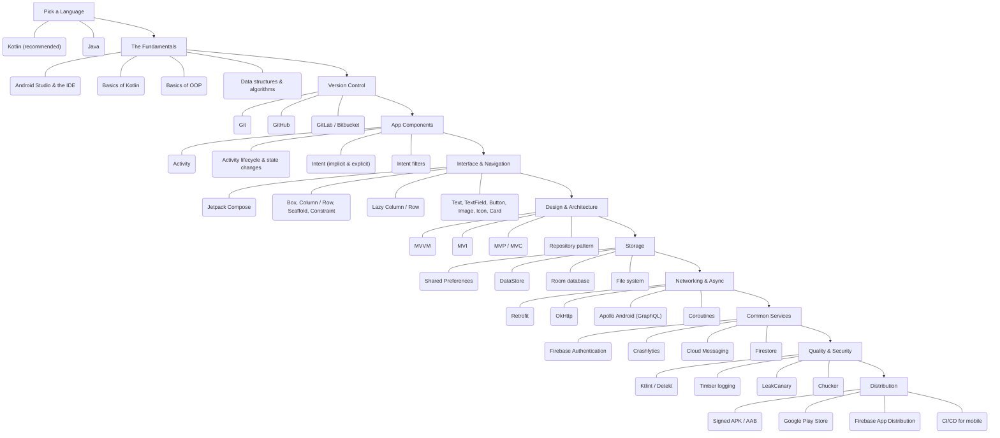

# 🤖 Android Developer Roadmap
### مطوّر أندرويد

*Native Android with Kotlin: components, Jetpack Compose, architecture, storage, networking, testing and distribution.*  
**أندرويد الأصلي بلغة Kotlin: المكوّنات، Jetpack Compose، المعمارية، التخزين، الشبكات، الاختبار والنشر.**

`11 stages` · `68 topics` · `AR / EN`

---

## 🗺️ The Map / الخريطة

---

## ✅ Step-by-step checklist / قائمة التقدّم

### 1. Pick a Language / اختر لغة

| # | Topic | الموضوع | Level / المستوى |
|---|---|---|---|
| 1 | Kotlin (recommended) | كوتلن (موصى بها) | Core · أساسي |
| 2 | Java | جافا | Recommended · موصى به |

### 2. The Fundamentals / الأساسيات

| # | Topic | الموضوع | Level / المستوى |
|---|---|---|---|
| 1 | Android Studio & the IDE | أندرويد ستوديو وبيئة التطوير | Core · أساسي |
| 2 | Basics of Kotlin | أساسيات كوتلن | Core · أساسي |
| 3 | Basics of OOP | أساسيات البرمجة الكائنية | Core · أساسي |
| 4 | Data structures & algorithms | هياكل البيانات والخوارزميات | Core · أساسي |
| 5 | What is Gradle and how to use it | ما هو Gradle وكيف تستخدمه | Core · أساسي |
| 6 | Build a basic Hello World app | ابنِ أول تطبيق Hello World | Core · أساسي |

### 3. Version Control / إدارة الإصدارات

| # | Topic | الموضوع | Level / المستوى |
|---|---|---|---|
| 1 | Git | جِت | Core · أساسي |
| 2 | GitHub | جيت هَب | Core · أساسي |
| 3 | GitLab / Bitbucket | جيت لاب / بِت بَكِت | Recommended · موصى به |

### 4. App Components / مكوّنات التطبيق

| # | Topic | الموضوع | Level / المستوى |
|---|---|---|---|
| 1 | Activity | النشاط Activity | Core · أساسي |
| 2 | Activity lifecycle & state changes | دورة حياة النشاط وتغيّر الحالة | Core · أساسي |
| 3 | Intent (implicit & explicit) | النوايا الصريحة والضمنية | Core · أساسي |
| 4 | Intent filters | مرشّحات النوايا | Recommended · موصى به |
| 5 | Tasks & back stack | المهام ومكدّس الرجوع | Recommended · موصى به |
| 6 | Services | الخدمات | Core · أساسي |
| 7 | Broadcast receiver | مستقبل البث | Recommended · موصى به |
| 8 | Content provider | مزوّد المحتوى | Recommended · موصى به |

### 5. Interface & Navigation / الواجهة والتنقّل

| # | Topic | الموضوع | Level / المستوى |
|---|---|---|---|
| 1 | Jetpack Compose | جِت باك كومبوز | Core · أساسي |
| 2 | Box, Column / Row, Scaffold, Constraint | التخطيطات: Box و Column/Row و Scaffold | Core · أساسي |
| 3 | Lazy Column / Row | القوائم الكسولة Lazy Column/Row | Core · أساسي |
| 4 | Text, TextField, Button, Image, Icon, Card | العناصر: النص والحقول والأزرار والصور والبطاقات | Core · أساسي |
| 5 | Dialog, BottomSheet, TabRow, Drawer | الحوارات والأوراق السفلية والتبويبات والقائمة الجانبية | Recommended · موصى به |
| 6 | Navigation components & NavHost | مكوّنات التنقّل و NavHost | Core · أساسي |
| 7 | remember / State, ViewModel state, side effects | إدارة الحالة والتأثيرات الجانبية | Core · أساسي |
| 8 | Animations | الحركات والانتقالات | Recommended · موصى به |
| 9 | App shortcuts | اختصارات التطبيق | Optional · اختياري |
| 10 | Legacy XML views: TextView, ImageView, RecyclerView, Fragments, ConstraintLayout | الواجهات القديمة بـXML: TextView و RecyclerView و Fragments | Recommended · موصى به |

### 6. Design & Architecture / التصميم والمعمارية

| # | Topic | الموضوع | Level / المستوى |
|---|---|---|---|
| 1 | MVVM | نمط MVVM | Core · أساسي |
| 2 | MVI | نمط MVI | Recommended · موصى به |
| 3 | MVP / MVC | نمط MVP و MVC | Optional · اختياري |
| 4 | Repository pattern | نمط المستودع | Core · أساسي |
| 5 | Builder, Factory, Observer patterns | أنماط Builder و Factory و Observer | Recommended · موصى به |
| 6 | Dependency injection | حقن التبعيات | Core · أساسي |
| 7 | Hilt / Dagger / Koin | Hilt و Dagger و Koin | Core · أساسي |
| 8 | Kotlin Flow & LiveData | Kotlin Flow و LiveData | Core · أساسي |
| 9 | RxJava / RxKotlin | RxJava و RxKotlin | Optional · اختياري |

### 7. Storage / التخزين

| # | Topic | الموضوع | Level / المستوى |
|---|---|---|---|
| 1 | Shared Preferences | التفضيلات المشتركة | Core · أساسي |
| 2 | DataStore | داتا ستور | Core · أساسي |
| 3 | Room database | قاعدة بيانات Room | Core · أساسي |
| 4 | File system | نظام الملفات | Recommended · موصى به |

### 8. Networking & Async / الشبكات والتزامن

| # | Topic | الموضوع | Level / المستوى |
|---|---|---|---|
| 1 | Retrofit | ريترو فِت | Core · أساسي |
| 2 | OkHttp | أوك إتش تي تي بي | Core · أساسي |
| 3 | Apollo Android (GraphQL) | أبولو أندرويد (GraphQL) | Optional · اختياري |
| 4 | Coroutines | الكوروتينات | Core · أساسي |
| 5 | Threads | الخيوط | Recommended · موصى به |
| 6 | WorkManager | مدير المهام WorkManager | Core · أساسي |

### 9. Common Services / الخدمات الشائعة

| # | Topic | الموضوع | Level / المستوى |
|---|---|---|---|
| 1 | Firebase Authentication | مصادقة Firebase | Core · أساسي |
| 2 | Crashlytics | كراشليتكس | Core · أساسي |
| 3 | Cloud Messaging | الرسائل السحابية | Core · أساسي |
| 4 | Firestore | فاير ستور | Recommended · موصى به |
| 5 | Remote Config | الإعدادات عن بُعد | Recommended · موصى به |
| 6 | Google AdMob | جوجل أدموب | Optional · اختياري |
| 7 | Google Play Services | خدمات جوجل بلاي | Recommended · موصى به |
| 8 | Google Maps | خرائط جوجل | Recommended · موصى به |

### 10. Quality & Security / الجودة والأمن

| # | Topic | الموضوع | Level / المستوى |
|---|---|---|---|
| 1 | Ktlint / Detekt | Ktlint و Detekt | Core · أساسي |
| 2 | Timber logging | التسجيل بـTimber | Core · أساسي |
| 3 | LeakCanary | ليك كناري | Recommended · موصى به |
| 4 | Chucker | تشَكر | Optional · اختياري |
| 5 | Jetpack Benchmark | قياس أداء Jetpack | Recommended · موصى به |
| 6 | JUnit | جي يونت | Core · أساسي |
| 7 | Espresso UI tests | اختبارات الواجهة Espresso | Core · أساسي |
| 8 | App security & obfuscation | أمن التطبيق والتعتيم | Core · أساسي |

### 11. Distribution / النشر والتوزيع

| # | Topic | الموضوع | Level / المستوى |
|---|---|---|---|
| 1 | Signed APK / AAB | حزمة موقّعة APK/AAB | Core · أساسي |
| 2 | Google Play Store | متجر جوجل بلاي | Core · أساسي |
| 3 | Firebase App Distribution | توزيع Firebase | Recommended · موصى به |
| 4 | CI/CD for mobile | CI/CD للتطبيقات | Recommended · موصى به |

---

### ⭐ Star the repository if this roadmap helps you.
### ⭐ ضع نجمة للمستودع إذا أفادتك هذه الخارطة.

Written and maintained by **[Majid Al-Sakani · ماجد السكني](https://github.com/majid-alsakani)** — Full Stack Developer (Python · FastAPI · Django · React), Yemen 🇾🇪

Keywords: android developer roadmap, خارطة طريق مطوّر أندرويد, android roadmap 2026, learn android step by step, مسار تعلم مطوّر أندرويد بالعربي, Majid Al-Sakani, ماجد السكني

© 2026 Majid Al-Sakani · ماجد السكني — CC BY-SA 4.0

