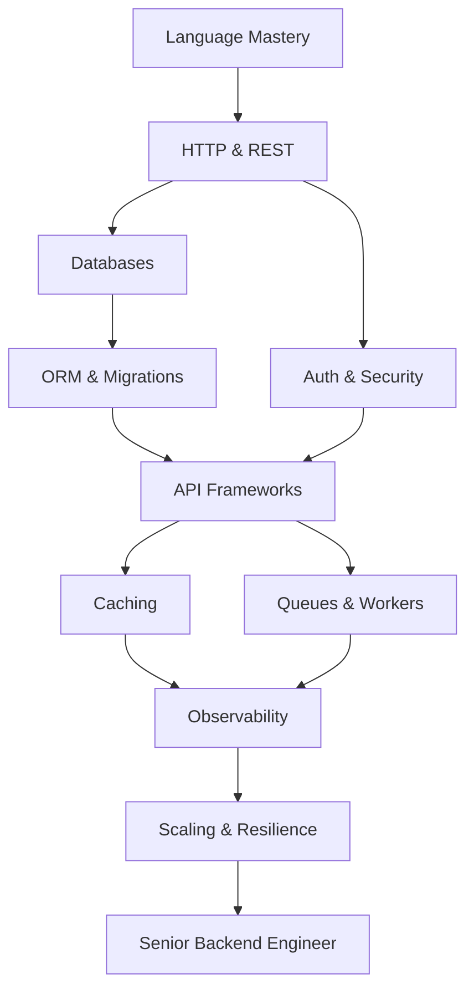

# 🛠️ Backend Developer Roadmap
### مطور الواجهات الخلفية

*APIs, databases, queues and distributed systems done properly.*  
**واجهات برمجية وقواعد بيانات وطوابير وأنظمة موزعة بشكل صحيح.**

---

## 🗺️ The Map / الخريطة

---

## ✅ Step-by-step checklist / قائمة التقدم

### 1. Foundations / الأساسيات

- [ ] One language deeply: Python / Go / Node.js
- [ ] HTTP, REST semantics, status codes
- [ ] JSON, serialization, validation
- [ ] Linux CLI, SSH, processes
- [ ] Git branching strategies

### 2. Data / البيانات

- [ ] Relational modeling & normalization
- [ ] PostgreSQL: indexes, EXPLAIN, transactions
- [ ] Redis: cache, locks, rate limiting
- [ ] Migrations: Alembic / Prisma
- [ ] NoSQL when it actually fits

### 3. Services / الخدمات

- [ ] FastAPI / Django REST / NestJS
- [ ] AuthN & AuthZ: JWT, OAuth2, RBAC
- [ ] Background jobs: Celery, RQ, BullMQ
- [ ] Message brokers: RabbitMQ, Kafka
- [ ] API design: pagination, idempotency, versioning

### 4. Scale / التوسع

- [ ] Caching layers & invalidation
- [ ] Horizontal scaling, load balancing
- [ ] Observability: logs, metrics, traces (OpenTelemetry)
- [ ] Resilience: retries, circuit breakers, timeouts
- [ ] Security: OWASP API Top 10, secrets management

---

## 📌 How to use this roadmap / كيف تستخدم الخريطة

1. Fork this repository — your fork becomes your personal progress tracker.
2. Tick the checkboxes as you master each item (`- [x]`).
3. Build one real project per stage; theory without shipping does not count.
4. Revisit every 3 months — the map evolves, so should you.

1. اعمل Fork للمستودع — النسخة تصبح سجل تقدّمك الشخصي.
2. علّم المربعات كلما أتقنت بندًا.
3. ابنِ مشروعًا حقيقيًا في كل مرحلة؛ النظرية بلا تنفيذ لا تُحتسب.
4. راجع الخريطة كل ٣ أشهر.

> Maintained by [Majid Al-Sakani](https://github.com/majid-alsakani) · Suggest an improvement via [issues](https://github.com/majid-alsakani/developer-roadmap/issues).
