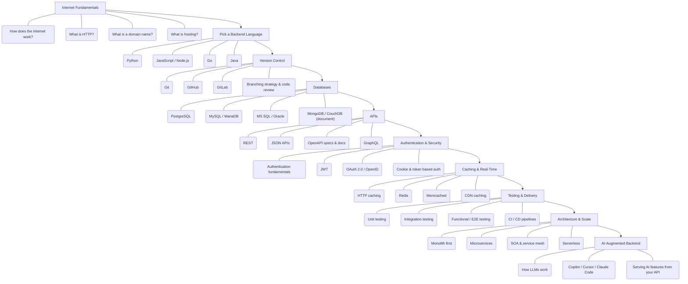

# 🛠️ Backend Developer Roadmap
### مطوّر الواجهات الخلفية

*The complete backend track: internet fundamentals, languages, databases, APIs, caching, security, architecture and scale.*  
**المسار الكامل للواجهات الخلفية: أساسيات الإنترنت، اللغات، قواعد البيانات، الـAPIs، الكاش، الأمن، المعمارية والتوسّع.**

`10 stages` · `82 topics` · `AR / EN`

---

## 🗺️ The Map / الخريطة

---

## ✅ Step-by-step checklist / قائمة التقدّم

### 1. Internet Fundamentals / أساسيات الإنترنت

| # | Topic | الموضوع | Level / المستوى |
|---|---|---|---|
| 1 | How does the internet work? | كيف يعمل الإنترنت؟ | Core · أساسي |
| 2 | What is HTTP? | ما هو HTTP؟ | Core · أساسي |
| 3 | What is a domain name? | ما هو اسم النطاق؟ | Core · أساسي |
| 4 | What is hosting? | ما هي الاستضافة؟ | Core · أساسي |
| 5 | DNS and how it works | نظام أسماء النطاقات وكيف يعمل | Core · أساسي |
| 6 | Browsers and how they work | المتصفحات وكيف تعمل | Recommended · موصى به |
| 7 | Frontend basics: HTML, CSS, JavaScript | أساسيات الواجهة: HTML و CSS و JavaScript | Recommended · موصى به |

### 2. Pick a Backend Language / اختر لغة خلفية

| # | Topic | الموضوع | Level / المستوى |
|---|---|---|---|
| 1 | Python | بايثون | Core · أساسي |
| 2 | JavaScript / Node.js | جافاسكربت / Node.js | Core · أساسي |
| 3 | Go | لغة Go | Recommended · موصى به |
| 4 | Java | جافا | Recommended · موصى به |
| 5 | C# | سي شارب | Recommended · موصى به |
| 6 | PHP | بي إتش بي | Optional · اختياري |
| 7 | Rust | رَست | Optional · اختياري |
| 8 | Ruby | روبي | Optional · اختياري |
| 9 | Build many projects in one language first | أتقن لغة واحدة وابنِ بها مشاريع كثيرة أولاً | Core · أساسي |

### 3. Version Control / إدارة الإصدارات

| # | Topic | الموضوع | Level / المستوى |
|---|---|---|---|
| 1 | Git | جِت | Core · أساسي |
| 2 | GitHub | جيت هَب | Core · أساسي |
| 3 | GitLab | جيت لاب | Recommended · موصى به |
| 4 | Branching strategy & code review | استراتيجية الفروع ومراجعة الكود | Core · أساسي |

### 4. Databases / قواعد البيانات

| # | Topic | الموضوع | Level / المستوى |
|---|---|---|---|
| 1 | PostgreSQL | بوستجريس | Core · أساسي |
| 2 | MySQL / MariaDB | ماي إس كيو إل / ماريا دي بي | Recommended · موصى به |
| 3 | MS SQL / Oracle | إم إس إس كيو إل / أوراكل | Optional · اختياري |
| 4 | MongoDB / CouchDB (document) | MongoDB / CouchDB (مستندية) | Recommended · موصى به |
| 5 | Redis / DynamoDB (key-value) | Redis / DynamoDB (مفتاح-قيمة) | Recommended · موصى به |
| 6 | Cassandra / ClickHouse (column) | Cassandra / ClickHouse (عمودية) | Optional · اختياري |
| 7 | Neo4j / DGraph (graph) | Neo4j / DGraph (رسم بياني) | Optional · اختياري |
| 8 | InfluxDB / TimescaleDB (time series) | InfluxDB / TimescaleDB (سلاسل زمنية) | Optional · اختياري |
| 9 | ORMs & query builders | أدوات ORM وبناء الاستعلامات | Core · أساسي |
| 10 | Normalization & data modeling | التطبيع ونمذجة البيانات | Core · أساسي |
| 11 | ACID & transactions | ACID والمعاملات | Core · أساسي |
| 12 | Indexes & query plans | الفهارس وخطط الاستعلام | Core · أساسي |
| 13 | N+1 problem & profiling | مشكلة N+1 وتحليل الأداء | Core · أساسي |
| 14 | Migrations | الترحيلات | Core · أساسي |
| 15 | Replication & sharding | النسخ والتقسيم | Recommended · موصى به |
| 16 | CAP theorem & failure modes | نظرية CAP وأنماط الفشل | Recommended · موصى به |

### 5. APIs / واجهات البرمجة

| # | Topic | الموضوع | Level / المستوى |
|---|---|---|---|
| 1 | REST | REST | Core · أساسي |
| 2 | JSON APIs | واجهات JSON | Core · أساسي |
| 3 | OpenAPI specs & docs | توثيق OpenAPI | Core · أساسي |
| 4 | GraphQL | جراف كيو إل | Recommended · موصى به |
| 5 | gRPC | جي آر بي سي | Recommended · موصى به |
| 6 | SOAP | صابون SOAP | Optional · اختياري |
| 7 | API security best practices | أفضل ممارسات أمن الـAPI | Core · أساسي |

### 6. Authentication & Security / المصادقة والأمن

| # | Topic | الموضوع | Level / المستوى |
|---|---|---|---|
| 1 | Authentication fundamentals | أساسيات المصادقة | Core · أساسي |
| 2 | JWT | رموز JWT | Core · أساسي |
| 3 | OAuth 2.0 / OpenID | OAuth 2.0 / OpenID | Core · أساسي |
| 4 | Cookie & token based auth | المصادقة بالكوكيز والتوكن | Core · أساسي |
| 5 | SAML | ساml | Optional · اختياري |
| 6 | Hashing: bcrypt, scrypt, SHA | التجزئة: bcrypt و scrypt و SHA | Core · أساسي |
| 7 | HTTPS & SSL/TLS | HTTPS و SSL/TLS | Core · أساسي |
| 8 | CORS & CSP | CORS و CSP | Core · أساسي |
| 9 | OWASP Top 10 risks | أهم 10 مخاطر OWASP | Core · أساسي |
| 10 | Server hardening | تحصين الخوادم | Recommended · موصى به |

### 7. Caching & Real-Time / الكاش والزمن الحقيقي

| # | Topic | الموضوع | Level / المستوى |
|---|---|---|---|
| 1 | HTTP caching | كاش HTTP | Core · أساسي |
| 2 | Redis | ريديس | Core · أساسي |
| 3 | Memcached | ممكاشد | Optional · اختياري |
| 4 | CDN caching | كاش شبكات التوزيع | Recommended · موصى به |
| 5 | WebSockets | ويب سوكِت | Core · أساسي |
| 6 | Server-Sent Events | الأحداث المرسلة من الخادم | Core · أساسي |
| 7 | Long / short polling | الاستطلاع الطويل والقصير | Recommended · موصى به |

### 8. Testing & Delivery / الاختبار والنشر

| # | Topic | الموضوع | Level / المستوى |
|---|---|---|---|
| 1 | Unit testing | اختبار الوحدات | Core · أساسي |
| 2 | Integration testing | اختبار التكامل | Core · أساسي |
| 3 | Functional / E2E testing | الاختبار الوظيفي والشامل | Recommended · موصى به |
| 4 | CI / CD pipelines | خطوط CI/CD | Core · أساسي |
| 5 | Docker & containers | دوكر والحاويات | Core · أساسي |
| 6 | Kubernetes | كوبرنيتيس | Recommended · موصى به |
| 7 | Basic operations skills | مهارات التشغيل الأساسية | Core · أساسي |

### 9. Architecture & Scale / المعمارية والتوسّع

| # | Topic | الموضوع | Level / المستوى |
|---|---|---|---|
| 1 | Monolith first | ابدأ بالمعمارية الأحادية | Core · أساسي |
| 2 | Microservices | الخدمات المصغّرة | Recommended · موصى به |
| 3 | SOA & service mesh | SOA وشبكة الخدمات | Optional · اختياري |
| 4 | Serverless | بدون خوادم | Recommended · موصى به |
| 5 | Twelve-factor apps | تطبيقات الاثني عشر عاملاً | Core · أساسي |
| 6 | Kafka / RabbitMQ message brokers | وسطاء الرسائل Kafka و RabbitMQ | Core · أساسي |
| 7 | Nginx / Caddy / Apache | Nginx و Caddy و Apache | Core · أساسي |
| 8 | Elasticsearch / Solr | محركات البحث Elasticsearch و Solr | Recommended · موصى به |
| 9 | Graceful degradation & throttling | التدهور الرشيق وتحديد المعدل | Recommended · موصى به |
| 10 | Circuit breaker & backpressure | قاطع الدائرة وضغط الرجوع | Recommended · موصى به |
| 11 | Observability: metrics, logs, tracing | الرصد: المقاييس والسجلات والتتبع | Core · أساسي |
| 12 | System design | تصميم الأنظمة | Core · أساسي |

### 10. AI-Augmented Backend / الخلفية المعزّزة بالذكاء الاصطناعي

| # | Topic | الموضوع | Level / المستوى |
|---|---|---|---|
| 1 | How LLMs work | كيف تعمل النماذج اللغوية | Recommended · موصى به |
| 2 | Copilot / Cursor / Claude Code | Copilot و Cursor و Claude Code | Recommended · موصى به |
| 3 | Serving AI features from your API | تقديم مزايا الذكاء الاصطناعي عبر الـAPI | Recommended · موصى به |

---

### ⭐ Star the repository if this roadmap helps you.
### ⭐ ضع نجمة للمستودع إذا أفادتك هذه الخارطة.

Written and maintained by **[Majid Al-Sakani · ماجد السكني](https://github.com/majid-alsakani)** — Full Stack Developer (Python · FastAPI · Django · React), Yemen 🇾🇪

Keywords: backend developer roadmap, خارطة طريق مطوّر الواجهات الخلفية, backend roadmap 2026, learn backend step by step, مسار تعلم مطوّر الواجهات الخلفية بالعربي, Majid Al-Sakani, ماجد السكني

© 2026 Majid Al-Sakani · ماجد السكني — CC BY-SA 4.0

