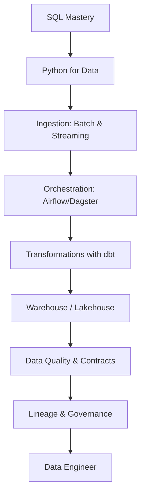

# 📊 Data Engineer Roadmap
### مهندس البيانات

*Reliable pipelines, modeled warehouses, trusted metrics.*  
**خطوط بيانات موثوقة ومستودعات منمذجة ومؤشرات جديرة بالثقة.**

---

## 🗺️ The Map / الخريطة

---

## ✅ Step-by-step checklist / قائمة التقدم

### 1. Core / النواة

- [ ] Advanced SQL: window functions, CTEs
- [ ] Python for data: pandas, Polars
- [ ] Data formats: Parquet, Avro, JSON Lines

### 2. Pipelines / الخطوط

- [ ] Batch vs streaming mental model
- [ ] Airflow / Dagster orchestration
- [ ] dbt transformations & tests
- [ ] CDC with Debezium / Kafka

### 3. Storage / التخزين

- [ ] Warehouses: BigQuery, Snowflake, DuckDB
- [ ] Lakehouse: Iceberg / Delta
- [ ] Partitioning & cost control

### 4. Trust / الثقة

- [ ] Data quality tests & contracts
- [ ] Lineage & catalogs
- [ ] Governance, PII handling, retention

---

## 📌 How to use this roadmap / كيف تستخدم الخريطة

1. Fork this repository — your fork becomes your personal progress tracker.
2. Tick the checkboxes as you master each item (`- [x]`).
3. Build one real project per stage; theory without shipping does not count.
4. Revisit every 3 months — the map evolves, so should you.

1. اعمل Fork للمستودع — النسخة تصبح سجل تقدّمك الشخصي.
2. علّم المربعات كلما أتقنت بندًا.
3. ابنِ مشروعًا حقيقيًا في كل مرحلة؛ النظرية بلا تنفيذ لا تُحتسب.
4. راجع الخريطة كل ٣ أشهر.

> Maintained by [Majid Al-Sakani](https://github.com/majid-alsakani) · Suggest an improvement via [issues](https://github.com/majid-alsakani/developer-roadmap/issues).
