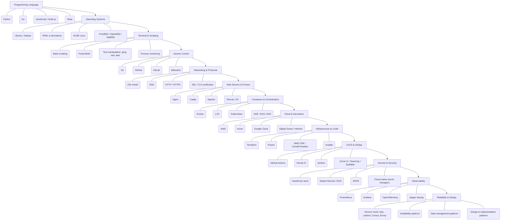

# ⚙️ DevOps Engineer / SRE Roadmap
### مهندس DevOps والموثوقية

*Automate, ship and operate reliable systems: Linux, networking, containers, IaC, CI/CD, observability and cloud.*  
**الأتمتة والنشر وتشغيل أنظمة موثوقة: لينكس، الشبكات، الحاويات، البنية ككود، CI/CD، الرصد، والسحابة.**

`13 stages` · `86 topics` · `AR / EN`

---

## 🗺️ The Map / الخريطة

---

## ✅ Step-by-step checklist / قائمة التقدّم

### 1. Programming Language / لغة برمجة

| # | Topic | الموضوع | Level / المستوى |
|---|---|---|---|
| 1 | Python | بايثون | Core · أساسي |
| 2 | Go | لغة Go | Core · أساسي |
| 3 | JavaScript / Node.js | جافاسكربت / Node.js | Recommended · موصى به |
| 4 | Ruby | روبي | Optional · اختياري |
| 5 | Rust | رَست | Optional · اختياري |

### 2. Operating Systems / أنظمة التشغيل

| # | Topic | الموضوع | Level / المستوى |
|---|---|---|---|
| 1 | Ubuntu / Debian | أوبنتو / ديبيان | Core · أساسي |
| 2 | RHEL & derivatives | ريدهات ومشتقاتها | Recommended · موصى به |
| 3 | SUSE Linux | سوزي لينكس | Optional · اختياري |
| 4 | FreeBSD / OpenBSD / NetBSD | أنظمة BSD | Optional · اختياري |
| 5 | Windows Server | ويندوز سيرفر | Optional · اختياري |
| 6 | Processes, memory, filesystems, permissions | العمليات والذاكرة وأنظمة الملفات والصلاحيات | Core · أساسي |

### 3. Terminal & Scripting / الطرفية والبرمجة النصية

| # | Topic | الموضوع | Level / المستوى |
|---|---|---|---|
| 1 | Bash scripting | سكربتات Bash | Core · أساسي |
| 2 | PowerShell | باور شل | Optional · اختياري |
| 3 | Text manipulation: grep, sed, awk | معالجة النصوص: grep و sed و awk | Core · أساسي |
| 4 | Process monitoring | مراقبة العمليات | Core · أساسي |
| 5 | Performance monitoring | مراقبة الأداء | Core · أساسي |
| 6 | Networking tools: dig, curl, ss, tcpdump | أدوات الشبكة: dig و curl و ss و tcpdump | Core · أساسي |
| 7 | Vim / Nano / Emacs | محررات Vim و Nano و Emacs | Recommended · موصى به |

### 4. Version Control / إدارة الإصدارات

| # | Topic | الموضوع | Level / المستوى |
|---|---|---|---|
| 1 | Git | جِت | Core · أساسي |
| 2 | GitHub | جيت هَب | Core · أساسي |
| 3 | GitLab | جيت لاب | Recommended · موصى به |
| 4 | Bitbucket | بِت بَكِت | Optional · اختياري |

### 5. Networking & Protocols / الشبكات والبروتوكولات

| # | Topic | الموضوع | Level / المستوى |
|---|---|---|---|
| 1 | OSI model | نموذج OSI | Core · أساسي |
| 2 | DNS | نظام أسماء النطاقات | Core · أساسي |
| 3 | HTTP / HTTPS | HTTP و HTTPS | Core · أساسي |
| 4 | SSL / TLS certificates | شهادات SSL/TLS | Core · أساسي |
| 5 | SSH | الاتصال الآمن SSH | Core · أساسي |
| 6 | FTP / SFTP | نقل الملفات FTP/SFTP | Recommended · موصى به |
| 7 | SMTP, IMAP, POP3S, SPF, DKIM, DMARC | بروتوكولات البريد: SMTP و IMAP و SPF و DMARC | Optional · اختياري |

### 6. Web Servers & Proxies / خوادم الويب والوسطاء

| # | Topic | الموضوع | Level / المستوى |
|---|---|---|---|
| 1 | Nginx | إن جينكس | Core · أساسي |
| 2 | Caddy | كادي | Recommended · موصى به |
| 3 | Apache | أباتشي | Recommended · موصى به |
| 4 | Tomcat / IIS | توم كات / IIS | Optional · اختياري |
| 5 | Reverse proxy | الوكيل العكسي | Core · أساسي |
| 6 | Forward proxy | الوكيل الأمامي | Recommended · موصى به |
| 7 | Load balancer | موزّع الأحمال | Core · أساسي |
| 8 | Caching server | خادم الكاش | Recommended · موصى به |
| 9 | Firewall | الجدار الناري | Core · أساسي |

### 7. Containers & Orchestration / الحاويات والتنسيق

| # | Topic | الموضوع | Level / المستوى |
|---|---|---|---|
| 1 | Docker | دوكر | Core · أساسي |
| 2 | LXC | حاويات LXC | Optional · اختياري |
| 3 | Kubernetes | كوبرنيتيس | Core · أساسي |
| 4 | GKE / EKS / AKS | الخدمات المُدارة GKE و EKS و AKS | Core · أساسي |
| 5 | AWS ECS / Fargate | AWS ECS و Fargate | Recommended · موصى به |
| 6 | Docker Swarm | دوكر سوارم | Optional · اختياري |
| 7 | OpenShift | أوبن شِفت | Optional · اختياري |

### 8. Cloud & Serverless / السحابة وبدون خوادم

| # | Topic | الموضوع | Level / المستوى |
|---|---|---|---|
| 1 | AWS | أمازون AWS | Core · أساسي |
| 2 | Azure | أزور | Recommended · موصى به |
| 3 | Google Cloud | جوجل كلاود | Recommended · موصى به |
| 4 | Digital Ocean / Hetzner | ديجيتال أوشن / هتزنر | Recommended · موصى به |
| 5 | AWS Lambda / Azure & GCP Functions | دوال AWS Lambda و Azure و GCP | Core · أساسي |
| 6 | Cloudflare Workers / Vercel / Netlify | Cloudflare Workers و Vercel و Netlify | Recommended · موصى به |
| 7 | Render / Railway / Heroku | Render و Railway و Heroku | Optional · اختياري |

### 9. Infrastructure as Code / البنية التحتية ككود

| # | Topic | الموضوع | Level / المستوى |
|---|---|---|---|
| 1 | Terraform | تيرافورم | Core · أساسي |
| 2 | Pulumi | بولومي | Recommended · موصى به |
| 3 | AWS CDK / CloudFormation | AWS CDK و CloudFormation | Recommended · موصى به |
| 4 | Ansible | أنسِبل | Core · أساسي |
| 5 | Chef / Puppet / Salt | Chef و Puppet و Salt | Optional · اختياري |

### 10. CI/CD & GitOps / التكامل والنشر المستمر

| # | Topic | الموضوع | Level / المستوى |
|---|---|---|---|
| 1 | GitHub Actions | GitHub Actions | Core · أساسي |
| 2 | GitLab CI | GitLab CI | Recommended · موصى به |
| 3 | Jenkins | جِنكِنز | Recommended · موصى به |
| 4 | Circle CI / TeamCity / Buildkite | Circle CI و TeamCity و Buildkite | Optional · اختياري |
| 5 | ArgoCD | أرجو سي دي | Core · أساسي |
| 6 | FluxCD | فلَكس سي دي | Recommended · موصى به |
| 7 | Artifactory / Nexus / Cloudsmith | إدارة الحزم: Artifactory و Nexus | Recommended · موصى به |

### 11. Secrets & Security / الأسرار والأمن

| # | Topic | الموضوع | Level / المستوى |
|---|---|---|---|
| 1 | HashiCorp Vault | خزنة Vault | Core · أساسي |
| 2 | Sealed Secrets / ESO | Sealed Secrets و ESO | Recommended · موصى به |
| 3 | SOPS | سوبس SOPS | Recommended · موصى به |
| 4 | Cloud-native secret managers | مديرو الأسرار السحابيون | Core · أساسي |
| 5 | Least privilege & IAM | أقل صلاحية وإدارة الهويات | Core · أساسي |

### 12. Observability / الرصد والمراقبة

| # | Topic | الموضوع | Level / المستوى |
|---|---|---|---|
| 1 | Prometheus | بروميثيوس | Core · أساسي |
| 2 | Grafana | جرافانا | Core · أساسي |
| 3 | OpenTelemetry | أوبن تيليمتري | Core · أساسي |
| 4 | Jaeger tracing | تتبع Jaeger | Recommended · موصى به |
| 5 | Loki | لوكي | Recommended · موصى به |
| 6 | Elastic Stack / Graylog | Elastic Stack و Graylog | Recommended · موصى به |
| 7 | Splunk / Papertrail | Splunk و Papertrail | Optional · اختياري |
| 8 | Datadog / New Relic / Dynatrace | Datadog و New Relic و Dynatrace | Optional · اختياري |
| 9 | Zabbix | زابكس | Optional · اختياري |
| 10 | SLI / SLO / error budgets | مؤشرات وأهداف الخدمة وميزانية الأخطاء | Core · أساسي |

### 13. Reliability & Design / الموثوقية والتصميم

| # | Topic | الموضوع | Level / المستوى |
|---|---|---|---|
| 1 | Service mesh: Istio, Linkerd, Consul, Envoy | شبكة الخدمات: Istio و Linkerd و Consul | Recommended · موصى به |
| 2 | Availability patterns | أنماط التوافرية | Core · أساسي |
| 3 | Data management patterns | أنماط إدارة البيانات | Recommended · موصى به |
| 4 | Design & implementation patterns | أنماط التصميم والتنفيذ | Recommended · موصى به |
| 5 | Management & monitoring patterns | أنماط الإدارة والمراقبة | Recommended · موصى به |
| 6 | Incident response & postmortems | الاستجابة للحوادث والتحليل اللاحق | Core · أساسي |
| 7 | Backups & disaster recovery | النسخ الاحتياطي والتعافي من الكوارث | Core · أساسي |

---

### ⭐ Star the repository if this roadmap helps you.
### ⭐ ضع نجمة للمستودع إذا أفادتك هذه الخارطة.

Written and maintained by **[Majid Al-Sakani · ماجد السكني](https://github.com/majid-alsakani)** — Full Stack Developer (Python · FastAPI · Django · React), Yemen 🇾🇪

Keywords: devops engineer / sre roadmap, خارطة طريق مهندس DevOps والموثوقية, devops roadmap 2026, learn devops step by step, مسار تعلم مهندس DevOps والموثوقية بالعربي, Majid Al-Sakani, ماجد السكني

© 2026 Majid Al-Sakani · ماجد السكني — CC BY-SA 4.0

