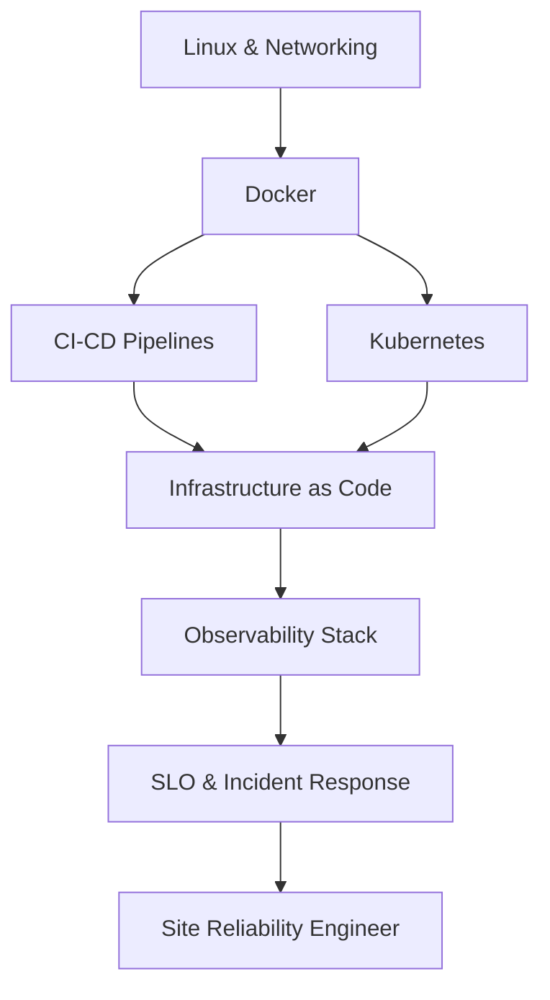

# ⚙️ DevOps / SRE Roadmap
### هندسة العمليات والموثوقية

*Ship safely, observe everything, automate the boring parts.*  
**نشر آمن، مراقبة شاملة، وأتمتة كل ما هو ممل.**

---

## 🗺️ The Map / الخريطة

---

## ✅ Step-by-step checklist / قائمة التقدم

### 1. Systems / الأنظمة

- [ ] Linux internals: processes, cgroups, systemd
- [ ] Networking: DNS, TLS, HTTP/2, load balancers
- [ ] Bash scripting & POSIX tools

### 2. Containers / الحاويات

- [ ] Docker: layers, multi-stage builds
- [ ] Compose for local environments
- [ ] Kubernetes: pods, services, ingress, HPA
- [ ] Helm / Kustomize

### 3. Automation / الأتمتة

- [ ] CI/CD with GitHub Actions
- [ ] IaC: Terraform, Pulumi
- [ ] Secrets: Vault, SOPS, cloud KMS
- [ ] Progressive delivery: blue-green, canary

### 4. Reliability / الموثوقية

- [ ] SLI/SLO/error budgets
- [ ] Prometheus + Grafana + Loki
- [ ] Incident response & postmortems
- [ ] Cost optimization & capacity planning

---

## 📌 How to use this roadmap / كيف تستخدم الخريطة

1. Fork this repository — your fork becomes your personal progress tracker.
2. Tick the checkboxes as you master each item (`- [x]`).
3. Build one real project per stage; theory without shipping does not count.
4. Revisit every 3 months — the map evolves, so should you.

1. اعمل Fork للمستودع — النسخة تصبح سجل تقدّمك الشخصي.
2. علّم المربعات كلما أتقنت بندًا.
3. ابنِ مشروعًا حقيقيًا في كل مرحلة؛ النظرية بلا تنفيذ لا تُحتسب.
4. راجع الخريطة كل ٣ أشهر.

> Maintained by [Majid Al-Sakani](https://github.com/majid-alsakani) · Suggest an improvement via [issues](https://github.com/majid-alsakani/developer-roadmap/issues).
