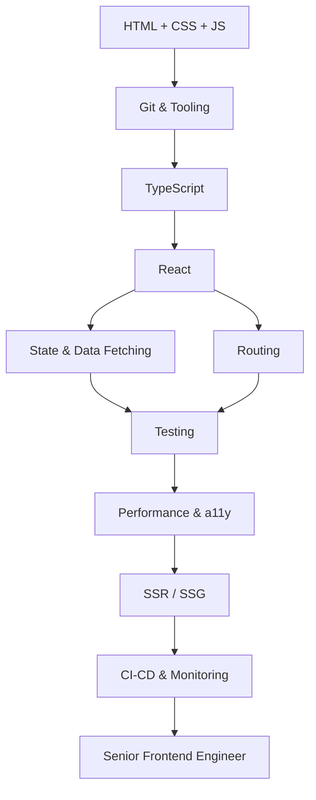

# 🎨 Frontend Developer Roadmap
### مطور الواجهات الأمامية

*From HTML fundamentals to production-grade React architecture.*  
**من أساسيات HTML إلى معمارية React جاهزة للإنتاج.**

---

## 🗺️ The Map / الخريطة

---

## ✅ Step-by-step checklist / قائمة التقدم

### 1. Foundations / الأساسيات

- [ ] HTML5 semantics & accessibility
- [ ] CSS box model, Flexbox, Grid
- [ ] JavaScript ES2015+ (modules, async/await)
- [ ] Git & GitHub workflow
- [ ] Chrome DevTools debugging

### 2. Core / النواة

- [ ] TypeScript (generics, narrowing)
- [ ] React 19 (hooks, suspense, server components)
- [ ] State: TanStack Query, Zustand
- [ ] Routing: TanStack Router / React Router
- [ ] Styling: Tailwind CSS, design tokens

### 3. Quality / الجودة

- [ ] Testing: Vitest, Testing Library, Playwright
- [ ] Accessibility: WCAG 2.2, ARIA, keyboard nav
- [ ] Performance: Core Web Vitals, code splitting
- [ ] Lint & format: ESLint, Prettier

### 4. Production / الإنتاج

- [ ] Build tools: Vite, Turbopack
- [ ] SSR/SSG: TanStack Start, Next.js, Astro
- [ ] Auth & security: OAuth2, CSP, XSS/CSRF
- [ ] Observability: Sentry, Web Vitals RUM
- [ ] CI/CD: GitHub Actions, preview deploys

---

## 📌 How to use this roadmap / كيف تستخدم الخريطة

1. Fork this repository — your fork becomes your personal progress tracker.
2. Tick the checkboxes as you master each item (`- [x]`).
3. Build one real project per stage; theory without shipping does not count.
4. Revisit every 3 months — the map evolves, so should you.

1. اعمل Fork للمستودع — النسخة تصبح سجل تقدّمك الشخصي.
2. علّم المربعات كلما أتقنت بندًا.
3. ابنِ مشروعًا حقيقيًا في كل مرحلة؛ النظرية بلا تنفيذ لا تُحتسب.
4. راجع الخريطة كل ٣ أشهر.

> Maintained by [Majid Al-Sakani](https://github.com/majid-alsakani) · Suggest an improvement via [issues](https://github.com/majid-alsakani/developer-roadmap/issues).
