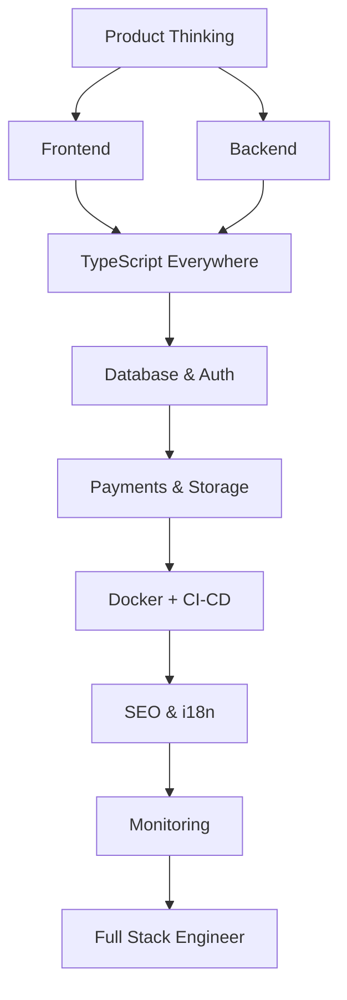

# 🚀 Full Stack Developer Roadmap
### مطور متكامل

*One person, one product: frontend, backend, data and delivery.*  
**شخص واحد، منتج كامل: واجهة وخلفية وبيانات ونشر.**

---

## 🗺️ The Map / الخريطة

---

## ✅ Step-by-step checklist / قائمة التقدم

### 1. Product / المنتج

- [ ] Requirements → user stories → scope cutting
- [ ] Wireframing & design systems
- [ ] Analytics & feedback loops

### 2. Build / البناء

- [ ] TypeScript across the stack
- [ ] React + a meta-framework (TanStack Start / Next.js)
- [ ] FastAPI or Node API layer
- [ ] PostgreSQL + Redis
- [ ] Auth, billing (Stripe), file storage

### 3. Ship / النشر

- [ ] Docker + GitHub Actions
- [ ] Preview environments per PR
- [ ] Monitoring & error tracking
- [ ] SEO: SSR, metadata, sitemaps, JSON-LD

### 4. Grow / التطوير

- [ ] Performance budgets
- [ ] A/B testing
- [ ] Internationalization (i18n + RTL)
- [ ] Technical writing & documentation

---

## 📌 How to use this roadmap / كيف تستخدم الخريطة

1. Fork this repository — your fork becomes your personal progress tracker.
2. Tick the checkboxes as you master each item (`- [x]`).
3. Build one real project per stage; theory without shipping does not count.
4. Revisit every 3 months — the map evolves, so should you.

1. اعمل Fork للمستودع — النسخة تصبح سجل تقدّمك الشخصي.
2. علّم المربعات كلما أتقنت بندًا.
3. ابنِ مشروعًا حقيقيًا في كل مرحلة؛ النظرية بلا تنفيذ لا تُحتسب.
4. راجع الخريطة كل ٣ أشهر.

> Maintained by [Majid Al-Sakani](https://github.com/majid-alsakani) · Suggest an improvement via [issues](https://github.com/majid-alsakani/developer-roadmap/issues).
