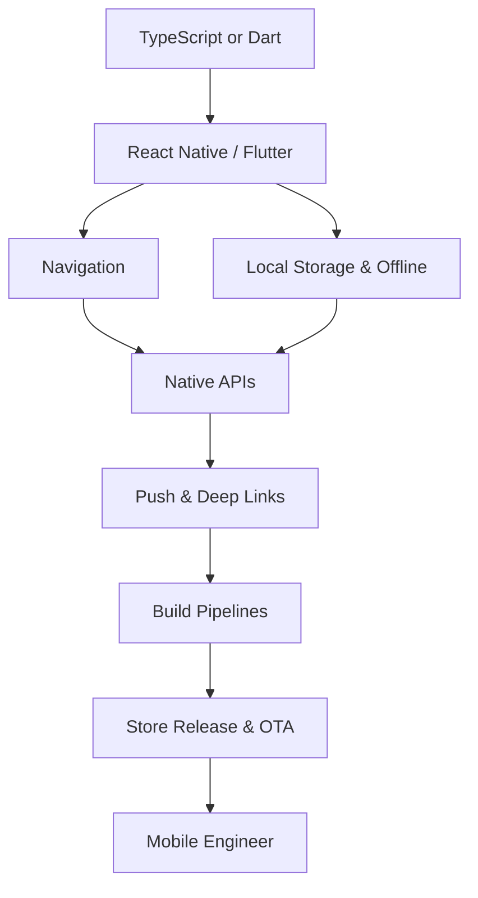

# 📱 Mobile Developer Roadmap
### مطور تطبيقات الجوال

*Cross-platform apps that feel native on both stores.*  
**تطبيقات متعددة المنصات بإحساس أصلي على المتجرين.**

---

## 🗺️ The Map / الخريطة

---

## ✅ Step-by-step checklist / قائمة التقدم

### 1. Basics / الأساسيات

- [ ] Mobile UX & platform guidelines (HIG, Material)
- [ ] JavaScript/TypeScript or Dart
- [ ] Responsive layout & safe areas

### 2. Framework / الإطار

- [ ] React Native + Expo (or Flutter)
- [ ] Navigation & deep links
- [ ] Offline-first storage (SQLite, MMKV)
- [ ] Push notifications

### 3. Native / الأصلي

- [ ] Native modules & permissions
- [ ] Camera, location, biometrics
- [ ] Performance profiling on device

### 4. Release / الإصدار

- [ ] EAS / Fastlane build pipelines
- [ ] App Store & Play Store review process
- [ ] Crash reporting & OTA updates

---

## 📌 How to use this roadmap / كيف تستخدم الخريطة

1. Fork this repository — your fork becomes your personal progress tracker.
2. Tick the checkboxes as you master each item (`- [x]`).
3. Build one real project per stage; theory without shipping does not count.
4. Revisit every 3 months — the map evolves, so should you.

1. اعمل Fork للمستودع — النسخة تصبح سجل تقدّمك الشخصي.
2. علّم المربعات كلما أتقنت بندًا.
3. ابنِ مشروعًا حقيقيًا في كل مرحلة؛ النظرية بلا تنفيذ لا تُحتسب.
4. راجع الخريطة كل ٣ أشهر.

> Maintained by [Majid Al-Sakani](https://github.com/majid-alsakani) · Suggest an improvement via [issues](https://github.com/majid-alsakani/developer-roadmap/issues).
