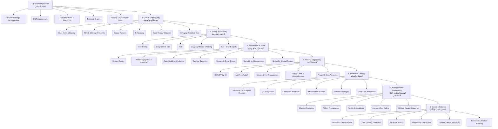

# 🏆 Professional Software Engineer Roadmap · مسار المبرمج المحترف

> **Author / إعداد:** [Majid Al-Sakani — ماجد السكني](https://github.com/majid-alsakani) · Full Stack & AI Engineer, Yemen 🇾🇪

**The senior track: engineering mindset, clean architecture, testing, security, DevOps, AI-augmented workflow and career growth.**  
**المسار الاحترافي: عقلية الهندسة، البنية النظيفة، الاختبار، الأمان، DevOps، العمل مع الذكاء الاصطناعي، والنمو المهني.**

`8 stages` · `45 topics` · [▶ Open the interactive version](https://majid-alsakani.github.io/developer-roadmap/roadmap.html?r=professional)

---

## 🗺️ The map / المخطط

---

## 📚 Stages / المراحل

### 1. Engineering Mindset — عقلية المهندس

| ✓ | Topic / الموضوع | Level | Why it matters / لماذا يهم | Resources |
|---|---|---|---|---|
| [ ] | **Problem Solving & Decomposition** · حل المشكلات وتفكيكها | 🔴 Core | Break problems into small testable parts before writing code. ابدأ بتفكيك المشكلة إلى أجزاء صغيرة قابلة للاختبار قبل كتابة أي سطر كود. | [CS Fundamentals](https://roadmap.sh/computer-science) |
| [ ] | **CS Fundamentals** · أساسيات علوم الحاسب | 🔴 Core | Memory, complexity and core structures separate seniors from beginners. الذاكرة، التعقيد الزمني، والبنى الأساسية هي فرق المبرمج المحترف عن المبتدئ. | [Harvard CS50 (Free)](https://cs50.harvard.edu/x/) |
| [ ] | **Data Structures & Algorithms** · هياكل البيانات والخوارزميات | 🔴 Core | Practice short daily problems instead of rare long sessions. تدرّب يوميًا على مسائل قصيرة بدل جلسات طويلة متقطعة. | [NeetCode Roadmap](https://neetcode.io/roadmap) |
| [ ] | **Technical English** · الإنجليزية التقنية | 🟡 Recommended | Reading official docs in English saves you years. قراءة التوثيق الرسمي بالإنجليزية تختصر عليك سنوات. | — |
| [ ] | **Reading Other People's Code** · قراءة كود الآخرين | 🟡 Recommended | Read open-source repos weekly and analyse their decisions. اقرأ مستودعات مفتوحة المصدر أسبوعيًا وحلّل قراراتها. | — |

### 2. Craft & Code Quality — جودة الكود والحِرفية

| ✓ | Topic / الموضوع | Level | Why it matters / لماذا يهم | Resources |
|---|---|---|---|---|
| [ ] | **Clean Code & Naming** · الكود النظيف والتسمية | 🔴 Core | Clear names are free documentation. الأسماء الواضحة توثيق مجاني؛ الكود يُقرأ أكثر مما يُكتب. | — |
| [ ] | **SOLID & Design Principles** · مبادئ SOLID والتصميم | 🔴 Core | Apply them consciously; the goal is lowering cost of change. طبّقها بوعي لا بشكل أعمى — الهدف تقليل كلفة التغيير. | [Refactoring Guru](https://refactoring.guru/design-patterns) |
| [ ] | **Design Patterns** · أنماط التصميم | 🟡 Recommended | Patterns are a shared language between engineers. تعلّم الأنماط كلغة تواصل بين المهندسين. | — |
| [ ] | **Refactoring** · إعادة الهيكلة | 🔴 Core | Improve structure without changing behaviour, guarded by tests. حسّن البنية دون تغيير السلوك، وبخطوات صغيرة محمية بالاختبارات. | — |
| [ ] | **Code Review Etiquette** · آداب مراجعة الكود | 🔴 Core | Review the code, not the person; explain the why. راجع الكود لا الشخص، واشرح السبب لا الأمر فقط. | — |
| [ ] | **Managing Technical Debt** · إدارة الدَّين التقني | 🟡 Recommended | Track tech debt as visible tasks. سجّل الدَّين التقني كمهام مرئية بدل تركه مخفيًا. | — |

### 3. Testing & Reliability — الاختبار والموثوقية

| ✓ | Topic / الموضوع | Level | Why it matters / لماذا يهم | Resources |
|---|---|---|---|---|
| [ ] | **Unit Testing** · اختبارات الوحدة | 🔴 Core | Fast isolated tests for each meaningful behaviour. اختبار سريع ومعزول لكل سلوك مهم. | — |
| [ ] | **Integration & E2E** · اختبارات التكامل والشاملة | 🔴 Core | Cover critical user journeys first. غطِّ المسارات الحرجة للمستخدم أولًا. | [Playwright](https://playwright.dev/) |
| [ ] | **TDD** · التطوير المقاد بالاختبار | ⚪ Optional | Best for complex logic, less for pure UI. مفيد في المنطق المعقّد أكثر من واجهات العرض. | — |
| [ ] | **Logging, Metrics & Tracing** · السجلات والقياسات والتتبّع | 🔴 Core | You cannot fix what you cannot see. لا يمكنك إصلاح ما لا تستطيع رؤيته. | [OpenTelemetry Docs](https://opentelemetry.io/docs/) |
| [ ] | **SLO / Error Budgets** · مستويات الخدمة وميزانية الأخطاء | ⚪ Optional | Define acceptable failure instead of chasing perfection. حدّد نسبة الفشل المقبولة بدل السعي للكمال. | [Google SRE Books](https://sre.google/books/) |

### 4. Architecture at Scale — البنية على نطاق واسع

| ✓ | Topic / الموضوع | Level | Why it matters / لماذا يهم | Resources |
|---|---|---|---|---|
| [ ] | **System Design** · تصميم الأنظمة | 🔴 Core | Start from non-functional needs: load, latency, availability. ابدأ من المتطلبات غير الوظيفية: الحمل، التأخير، التوافر. | [System Design Primer](https://github.com/donnemartin/system-design-primer) |
| [ ] | **API Design (REST / GraphQL)** · تصميم الواجهات البرمجية | 🔴 Core | Contract first: design and document before coding. العقد قبل الكود: صمّم الواجهة ووثّقها أولًا. | [OpenAPI Spec](https://swagger.io/specification/) |
| [ ] | **Data Modeling & Indexing** · نمذجة البيانات والفهارس | 🔴 Core | Most performance issues start in the schema. ٩٠٪ من مشاكل الأداء تبدأ من تصميم قاعدة البيانات. | — |
| [ ] | **Caching Strategies** · استراتيجيات التخزين المؤقت | 🟡 Recommended | Know your invalidation before you cache. اعرف متى تُبطل الكاش قبل أن تستخدمه. | — |
| [ ] | **Queues & Event-Driven** · الطوابير والأنظمة الحدثية | 🟡 Recommended | Move long work out of the request cycle. افصل العمليات الطويلة عن دورة الطلب. | — |
| [ ] | **Monolith vs Microservices** · الأحادي مقابل الخدمات المصغّرة | ⚪ Optional | Start with a modular monolith; split only when needed. ابدأ أحاديًا منظّمًا؛ لا تقسّم قبل أن تحتاج. | — |
| [ ] | **Scalability & Load Testing** · التوسّع واختبار الحمل | 🟡 Recommended | Measure before optimising. قِس قبل أن تحسّن، وحسّن ما يهم فقط. | [k6 Load Testing](https://k6.io/docs/) |

### 5. Security Engineering — هندسة الأمان

| ✓ | Topic / الموضوع | Level | Why it matters / لماذا يهم | Resources |
|---|---|---|---|---|
| [ ] | **OWASP Top 10** · أهم عشر ثغرات | 🔴 Core | The first checklist any professional reviewer runs. أول ما يفحصه أي مراجع محترف لتطبيقك. | [OWASP Top 10](https://owasp.org/www-project-top-ten/) |
| [ ] | **AuthN vs AuthZ** · المصادقة مقابل الصلاحيات | 🔴 Core | Identity and permission are two different problems. من أنت شيء، وماذا تملك حق فعله شيء آخر. | — |
| [ ] | **Secrets & Key Management** · إدارة المفاتيح والأسرار | 🔴 Core | Never commit keys; rotate regularly. لا مفاتيح في المستودع أبدًا، ودوّر المفاتيح دوريًا. | — |
| [ ] | **Supply Chain & Dependencies** · سلسلة الإمداد والاعتماديات | 🟡 Recommended | Scan dependencies automatically and sign releases. افحص الاعتماديات آليًا ووقّع إصداراتك. | — |
| [ ] | **Privacy & Data Protection** · الخصوصية وحماية البيانات | 🟡 Recommended | Collect the least data for the shortest time. اجمع أقل قدر من البيانات ولأقصر مدة. | — |

### 6. DevOps & Delivery — التشغيل والتسليم

| ✓ | Topic / الموضوع | Level | Why it matters / لماذا يهم | Resources |
|---|---|---|---|---|
| [ ] | **Advanced Git & Signed Commits** · Git المتقدّم والكوميتات الموقّعة | 🔴 Core | Rebase, bisect and signed commits signal maturity. rebase، bisect، وتوقيع الكوميتات علامات نضج تقني. | [Pro Git Book](https://git-scm.com/book/en/v2) |
| [ ] | **CI/CD Pipelines** · خطوط التكامل والنشر | 🔴 Core | Every merge passes automated tests and linting. كل دمج يجب أن يمرّ باختبار وفحص جودة آلي. | [GitHub Actions](https://docs.github.com/actions) |
| [ ] | **Containers & Docker** · الحاويات ودوكر | 🔴 Core | One identical environment from laptop to production. بيئة موحّدة من جهازك حتى الإنتاج. | [Docker Get Started](https://docs.docker.com/get-started/) |
| [ ] | **Infrastructure as Code** · البنية ككود | 🟡 Recommended | Your infra should rebuild with one command. بنيتك يجب أن تُعاد بناؤها بأمر واحد. | — |
| [ ] | **Release Strategies** · استراتيجيات الإصدار | 🟡 Recommended | Canary, blue-green and flags reduce release risk. Canary وBlue-Green وfeature flags تقلّل خطر النشر. | — |
| [ ] | **Cloud Cost Awareness** · وعي تكلفة السحابة | ⚪ Optional | Professionals balance performance and cost. المهندس المحترف يوازن بين الأداء والتكلفة. | — |

### 7. AI-Augmented Engineering — الهندسة المعزّزة بالذكاء الاصطناعي

| ✓ | Topic / الموضوع | Level | Why it matters / لماذا يهم | Resources |
|---|---|---|---|---|
| [ ] | **Effective Prompting** · الصياغة الفعّالة للأوامر | 🔴 Core | Give context, constraints and acceptance criteria. اعطِ سياقًا وقيودًا ومعايير قبول واضحة. | [Prompt Engineering Guide](https://www.promptingguide.ai/) |
| [ ] | **AI Pair Programming** · البرمجة الثنائية بالذكاء الاصطناعي | 🔴 Core | Use it as an accelerator, never a replacement for understanding. استخدمه مسرّعًا لا بديلًا عن الفهم. | — |
| [ ] | **RAG & Embeddings** · الاسترجاع المعزّز والتضمينات | 🟡 Recommended | Ground models in your data instead of retraining. اربط النماذج ببياناتك بدل إعادة تدريبها. | [RAG Tutorial](https://python.langchain.com/docs/tutorials/rag/) |
| [ ] | **Agents & Tool Calling** · الوكلاء واستدعاء الأدوات | 🟡 Recommended | An agent = planner + tools + memory + critic. الوكيل = تخطيط + أدوات + ذاكرة + تقييم. | — |
| [ ] | **AI Code Review Guardrails** · ضوابط مراجعة الكود بالذكاء | ⚪ Optional | Never merge code you do not understand. لا تدمج كودًا لا تفهمه ولو كتبه نموذج ممتاز. | — |

### 8. Career & Influence — المسار المهني والتأثير

| ✓ | Topic / الموضوع | Level | Why it matters / لماذا يهم | Resources |
|---|---|---|---|---|
| [ ] | **Portfolio & GitHub Profile** · معرض الأعمال وملف GitHub | 🔴 Core | Three deep projects beat thirty shallow ones. ثلاثة مشاريع عميقة أقوى من ثلاثين مشروعًا سطحيًا. | — |
| [ ] | **Open Source Contribution** · المساهمة في المصادر المفتوحة | 🔴 Core | Start with docs or a small bug in a tool you use. ابدأ بإصلاح توثيق أو خطأ صغير في مشروع تستخدمه. | — |
| [ ] | **Technical Writing** · الكتابة التقنية | 🟡 Recommended | Explaining what you learn builds both mastery and reputation. اشرح ما تعلّمته؛ الشرح يثبّت الفهم ويبني السمعة. | — |
| [ ] | **Mentoring & Leadership** · الإرشاد والقيادة | 🟡 Recommended | Senior engineers lift the people around them. المهندس الكبير يرفع من حوله لا نفسه فقط. | — |
| [ ] | **System Design Interviews** · مقابلات تصميم الأنظمة | ⚪ Optional | Practise explaining trade-offs out loud. تدرّب بصوت عالٍ على شرح المقايضات. | — |
| [ ] | **Freelance & Product Thinking** · العمل الحر والتفكير المنتجي | ⚪ Optional | Understand user value, not just technology. افهم قيمة ما تبنيه للمستخدم لا التقنية فقط. | — |

---

## 🎯 How to use / كيف تستخدمها

1. **Fork** this repository and tick the checkboxes as you progress. / اعمل Fork وعلّم المربعات مع تقدّمك.
2. Open the [interactive version](https://majid-alsakani.github.io/developer-roadmap/roadmap.html?r=professional) — progress is saved in your browser. / النسخة التفاعلية تحفظ تقدّمك تلقائيًا.
3. Build one real project per stage. / ابنِ مشروعًا حقيقيًا لكل مرحلة.

---

**Created & maintained by [Majid Al-Sakani · ماجد السكني](https://github.com/majid-alsakani)** — Full Stack Developer · Python · FastAPI · Django · React · AI Agents · Yemen

