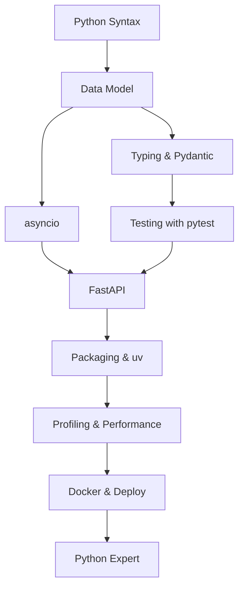

# 🐍 Python Engineer Roadmap
### مهندس بايثون

*Modern Python: typing, async, packaging and performance.*  
**بايثون الحديثة: الأنواع، التزامن، التغليف والأداء.**

---

## 🗺️ The Map / الخريطة

---

## ✅ Step-by-step checklist / قائمة التقدم

### 1. Language / اللغة

- [ ] Data model: dunder methods, descriptors
- [ ] Typing: generics, Protocol, TypedDict
- [ ] Iterators, generators, context managers
- [ ] Dataclasses & Pydantic v2
- [ ] Errors & exception design

### 2. Async / التزامن

- [ ] asyncio event loop mental model
- [ ] async/await, TaskGroup, cancellation
- [ ] httpx, aiofiles, async DB drivers
- [ ] Threads vs processes vs async (GIL)

### 3. Tooling / الأدوات

- [ ] uv / poetry dependency management
- [ ] ruff (lint+format), mypy strict
- [ ] pytest: fixtures, parametrize, coverage
- [ ] pre-commit hooks
- [ ] Packaging & publishing to PyPI

### 4. Production / الإنتاج

- [ ] FastAPI + Uvicorn/Gunicorn tuning
- [ ] Profiling: cProfile, py-spy, memray
- [ ] Caching & vectorized work with NumPy/Polars
- [ ] Docker images that are actually small
- [ ] Typed config & 12-factor apps

---

## 📌 How to use this roadmap / كيف تستخدم الخريطة

1. Fork this repository — your fork becomes your personal progress tracker.
2. Tick the checkboxes as you master each item (`- [x]`).
3. Build one real project per stage; theory without shipping does not count.
4. Revisit every 3 months — the map evolves, so should you.

1. اعمل Fork للمستودع — النسخة تصبح سجل تقدّمك الشخصي.
2. علّم المربعات كلما أتقنت بندًا.
3. ابنِ مشروعًا حقيقيًا في كل مرحلة؛ النظرية بلا تنفيذ لا تُحتسب.
4. راجع الخريطة كل ٣ أشهر.

> Maintained by [Majid Al-Sakani](https://github.com/majid-alsakani) · Suggest an improvement via [issues](https://github.com/majid-alsakani/developer-roadmap/issues).
